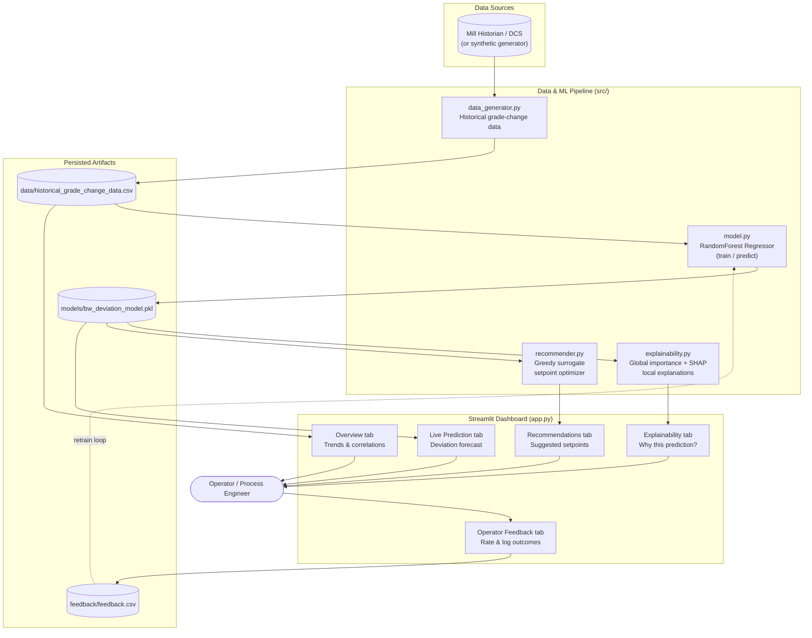

# AI-Powered Grade Change Intelligence for Paper Manufacturing

An AI-driven decision-support system that predicts and prevents **Basis
Weight (BW) quality deviations** during paper grade transitions. It analyzes
historical process data to surface known and hidden correlations, predicts
BW deviations before they exceed spec, explains *why* in plain language, and
recommends setpoint changes to stabilize the process faster — all through an
interactive Streamlit dashboard, with operator feedback captured for
continuous learning.

Built for beginners: every file is commented, and on Windows the two
included batch files (`setup.bat` then `start.bat`) are all you need to see
it running.

---

## 1. What's inside

| Capability (from the brief)              | Where it lives |
|-------------------------------------------|----------------|
| Historical data analysis / correlations   | `Overview` tab — correlation heatmap, trend charts |
| Predict BW deviations before limits break | `Live Prediction` tab — RandomForest model + forecast |
| Recommend setpoints, reduce stabilization | `Recommendations` tab — greedy surrogate optimizer |
| Explainable recommendations               | `Explainability` tab — global + local (SHAP) attributions |
| Interactive dashboard                     | Full Streamlit app (`app.py`) |
| Operator feedback / continuous learning   | `Operator Feedback` tab — CSV log + retrain button |

---

## 2. Project structure

```
paper-grade-intelligence/
├── app.py                     # Streamlit dashboard (run this)
├── train.py                   # One-command setup: generate data + train model
├── setup.bat                  # Windows: double-click to install + train
├── start.bat                  # Windows: double-click to launch the dashboard
├── requirements.txt
├── .streamlit/config.toml     # Dashboard theme
├── data/
│   └── historical_grade_change_data.csv   # created by train.py
├── models/
│   ├── bw_deviation_model.pkl              # created by train.py
│   └── model_metadata.pkl
├── feedback/
│   └── feedback.csv                        # created when an operator submits feedback
└── src/
    ├── data_generator.py      # synthetic historical data (physics-inspired)
    ├── model.py                # RandomForest training / loading / predicting
    ├── explainability.py       # global importance + SHAP local explanations
    └── recommender.py          # greedy setpoint optimizer
```

> **Using real mill data?** Replace `data/historical_grade_change_data.csv`
> with your historian export using the same column names (see
> `src/model.py: FEATURE_COLUMNS`), then run `python train.py` again. Nothing
> else in the app needs to change.

---


## 3. How to use the dashboard

1. **Overview** — pick a historical grade transition in the sidebar, see its
   BW deviation trend against spec limits, and explore the correlation
   heatmap across all transitions.
2. **Live Prediction** — move the sliders to describe a current/planned
   process state and get an instant deviation prediction, risk level, and a
   45-minute forecast.
3. **Explainability** — see which variables matter most overall (global) and
   which ones are driving *this specific* prediction (local, SHAP-based).
4. **Recommendations** — click "Generate Recommendation" to get concrete
   setpoint changes that reduce the predicted deviation, with before/after
   numbers.
5. **Operator Feedback** — rate how useful a recommendation was, log what
   actually happened, and (optionally) click "Retrain Model Now" to simulate
   the continuous-learning loop.

---


## 4. Architecture




## 5. How the AI actually works (plain-language summary)

- **Prediction**: A Random Forest model learns, from thousands of historical
  minute-by-minute grade-change records, how variables like speed ramp rate,
  stock consistency error, steam pressure lag, headbox pressure, slice
  opening, and stock flow relate to Basis Weight deviation. Given a new
  process snapshot, it predicts the expected deviation in grams per square
  metre (gsm).
- **Explainability**: *Global* importance (from the forest's structure)
  shows which variables matter most in general. *Local* explanation (SHAP,
  with a dependency-free fallback if SHAP isn't installed) shows, for one
  specific prediction, exactly how much each variable pushed the number up
  or down — this is what makes recommendations trustworthy instead of a
  black box.
- **Recommendation**: A greedy search nudges controllable setpoints (speed,
  consistency, steam pressure, headbox pressure, slice opening, stock flow)
  within safe operating ranges, using the trained model as a fast stand-in
  ("surrogate") for the real process, to find changes that reduce the
  predicted deviation.
- **Continuous learning**: Operator feedback (was the recommendation useful?
  what actually happened?) is logged to `feedback/feedback.csv`. In a real
  deployment this would be merged into the training set on a schedule; the
  "Retrain Model Now" button demonstrates that loop.

---

